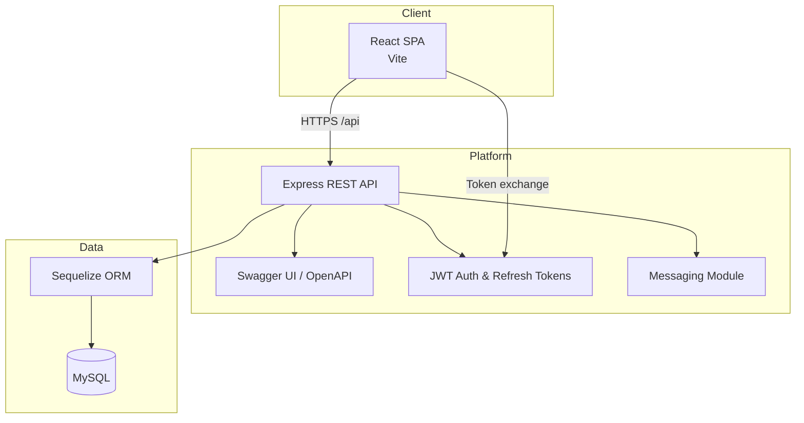

# EnduranceHub

EnduranceHub is a web platform that unites endurance athletes with their coaches, nutritionists, and medical staff. The solution consists of a REST API and a modern React single-page application.

## Problem Statement
- Deliver a shared workspace where the athlete and specialists can collaborate in real time.
- Keep track of athlete profiles, training plans, nutrition plans, and internal messages.
- Guarantee secure access using role-based permissions with short-lived JWT access tokens and rotating refresh tokens.

## Functional Requirements Coverage
- Three domain entities linked hierarchically: `Athlete -> Training Plan -> Nutrition Plan`.
- Five REST endpoints per entity (POST, GET, GET/{id}, PUT, DELETE), giving 15 distinct API methods in total.
- Hierarchical endpoints: `GET /athletes/{id}/training-plans` and `GET /athletes/{id}/nutrition-plans`.
- Roles implemented: `ATHLETE`, `SPECIALIST`, `ADMIN` (plus guest access handled on the client).
- Additional messaging module for team communication.
- MySQL database via Sequelize ORM, strict REST semantics, and consistent HTTP response codes for success and error cases.

## Architecture



Detailed notes: `docs/architecture.md`.

## API Documentation
- `backend/src/docs/openapi.yaml` - complete OpenAPI description of every REST method and error response.
- `http://localhost:4000/api/docs` - Swagger UI served by the backend.
- `docs/endurancehub.postman_collection.json` - Postman collection with 18 requests and automated tests covering 200/201/204/400/401/403/404/422 responses.

## Usage Examples

Obtain an access token via `POST /api/auth/login` and pass it in the `Authorization: Bearer <ACCESS_TOKEN>` header.

```bash
# -> 201 Created (training plan created)
curl -i -X POST http://localhost:4000/api/training-plans \
  -H "Content-Type: application/json" \
  -H "Authorization: Bearer <ACCESS_TOKEN>" \
  -d '{
        "athleteId": 1,
        "title": "Base week",
        "description": "Light introductory period",
        "startDate": "2025-01-06",
        "endDate": "2025-01-12",
        "intensityLevel": "LOW"
      }'

# -> 404 Not Found (plan does not exist)
curl -i http://localhost:4000/api/training-plans/9999 \
  -H "Authorization: Bearer <ACCESS_TOKEN>"

# -> 400 Bad Request (payload fails validation)
curl -i -X POST http://localhost:4000/api/athletes \
  -H "Content-Type: application/json" \
  -H "Authorization: Bearer <ACCESS_TOKEN>" \
  -d '{}'

# -> 204 No Content (nutrition plan deleted)
curl -i -X DELETE http://localhost:4000/api/nutrition-plans/2 \
  -H "Authorization: Bearer <ACCESS_TOKEN>"
```

## Documentation Assets
- `docs/architecture.md` - architecture diagram and component responsibilities.
- `backend/src/docs/openapi.yaml` - OpenAPI contract.
- `docs/endurancehub.postman_collection.json` - automated API demo.
- `docs/deployment.md` - cloud deployment guide (Render example).

## Coursework Requirement Checklist
- **REST API scope (15 methods)** ā€“ each domain object exposes the required CRUD + list endpoints, plus hierarchical lookups:

  | Domain object | Methods implemented | Paths |
  |---------------|---------------------|-------|
  | Athlete | POST, GET, GET/{id}, PUT, DELETE | `/api/athletes`, `/api/athletes/{id}` |
  | Athlete hierarchy | GET lists | `/api/athletes/{id}/training-plans`, `/api/athletes/{id}/nutrition-plans` |
  | Training plan | POST, GET, GET/{id}, PUT, DELETE | `/api/training-plans`, `/api/training-plans/{id}` |
  | Nutrition plan | POST, GET, GET/{id}, PUT, DELETE | `/api/nutrition-plans`, `/api/nutrition-plans/{id}` |
  | Message | POST, GET, GET/{id}, DELETE, PATCH | `/api/messages`, `/api/messages/{id}`, `/api/messages/{id}/read` |

  (Authentication endpoints `/api/auth/*` deliver register/login/refresh/logout/me workflows on top of the 15 domain methods.)

- **OpenAPI coverage** ā€“ `backend/src/docs/openapi.yaml` documents every endpoint above (including request/response schemas and shared error payloads); served via Swagger UI at `/api/docs`.
- **Execution environment** ā€“ `docker-compose.yml` plus the steps in this README let you start backend/frontend quickly for the defence; `docs/deployment.md` describes a Render deployment for cloud delivery.
- **Database with meaningful data** ā€“ Sequelize targets MySQL, and `npm run seed` loads realistic demo users, athletes, plans, and messages before the presentation.
- **Demonstration tooling** ā€“ `docs/endurancehub.postman_collection.json` exercises all endpoints (success + error cases). Run the whole defence sequence with:
  ```bash
  newman run docs/endurancehub.postman_collection.json
  ```
  The collection asserts 200/201/204 on success and covers error scenarios (400 validation, 404 not found, 401/403). Total runtime stays within the requested ~15 seconds.
- **HTTP semantics** ā€“ controllers return 201 on create, 204 on delete, 400/422 for invalid payloads, 404 for missing resources, and 401/403 when authorization fails (see `backend/src/controllers/*`).

## Local Setup

### Docker Compose (fastest path)
1. Make sure Docker and Docker Compose are installed.
2. From the project root run:
   ```bash
   docker compose up backend
   ```
3. The command installs dependencies, seeds the database, and starts the API at `http://localhost:4000`.

### Backend (manual)
1. Go to `backend`.
2. Create `.env` from `.env.example`.
3. Install dependencies: `npm install`.
4. Start the API: `npm run dev` (or `npm start` for production).
5. Swagger UI: `http://localhost:4000/api/docs`.

### Frontend (manual)
1. Go to `frontend`.
2. Create `.env` from `.env.example`.
3. Install dependencies: `npm install`.
4. Start dev server: `npm run dev`.
5. Default client URL: `http://localhost:5173`.

## Cloud Deployment
- Use `render.yaml` together with the steps in `docs/deployment.md` to publish the backend (Node service) and frontend (static site) on Render.
- Other platforms such as Railway, Fly.io, or AWS ECS can be used by supplying the same environment variables (`MYSQL_*`, `JWT_*`, `VITE_API_URL`) and running `npm run build` where needed.

## Data Seeding
- Seed script populates MySQL with meaningful demo data (users, athletes, plans, messages). **Warning:** it resets tables via `sync({ force: true })`.
  ```bash
  cd backend
  npm run seed
  ```
- Demo accounts:

| Role             | Email                     | Password         |
|------------------|---------------------------|------------------|
| Administrator    | admin@endurancehub.test   | AdminPass123!    |
| Specialist       | coach@endurancehub.test   | CoachPass123!    |
| Athlete Ruta     | runner@endurancehub.test  | AthleteOne123!   |
| Athlete Tomas    | triathlete@endurancehub.test | AthleteTwo123! |

## Postman Demonstration
- Collection: `docs/endurancehub.postman_collection.json`. Import into Postman or run it headless with Newman.
- Fast demo:
  ```bash
  cd backend
  npm install
  npm run demo
  ```
- The collection exercises every CRUD + list endpoint for Athletes, Training Plans, and Nutrition Plans (15 methods total) together with messaging and auth flows. Assertions cover:
  - `201 Created` on each POST (`/athletes`, `/training-plans`, `/nutrition-plans`, `/messages`).
  - `200 OK` on reads and updates (`GET`, `PUT`, `PATCH`) with key field checks.
  - `204 No Content` on deletions (`DELETE /athletes/{id}`, `/training-plans/{id}`, `/nutrition-plans/{id}`).
  - Error handling: `400` (invalid payload), `401` (bad credentials), `403` (forbidden), `404` (not found), `422` (business rule violation).
- During the run the tests log in as admin/specialist/athlete, provision and clean up a disposable athlete profile, create/update/delete training and nutrition plans, and trigger the required error scenarios. The whole demonstration completes in roughly 12–15 seconds on a typical laptop.

## Environment Variables

### Backend `.env`
```
PORT=4000
MYSQL_HOST=localhost
MYSQL_PORT=3306
MYSQL_USER=root
MYSQL_PASSWORD=secret
MYSQL_DB=endurancehub
JWT_ACCESS_SECRET=change-me-access
JWT_REFRESH_SECRET=change-me-refresh
ACCESS_TOKEN_TTL=15m
REFRESH_TOKEN_TTL=7d
CORS_ORIGIN=http://localhost:5173
```

### Frontend `.env`
```
VITE_API_URL=http://localhost:4000/api
```

## Day-to-day Usage
1. Register a user (athlete registration creates the athlete profile automatically).
2. After signing in, athletes see their dashboard, profile, and training/nutrition plans.
3. Specialists and administrators can create, edit, and delete plans and send internal messages.
4. Administrators have extra tooling to manage athlete profiles and assignments.

## Testing
- Backend: `npm run lint`.
- Frontend: `npm run build`.

## Conclusions
- Modular architecture clearly separates client, REST API, and data layers.
- Documentation set (OpenAPI, architecture diagram, usage examples, Postman tests) satisfies the coursework deliverables.
- Local and cloud deployment paths plus seeded demo data make it easy to demonstrate all 15 API methods and required error responses.


