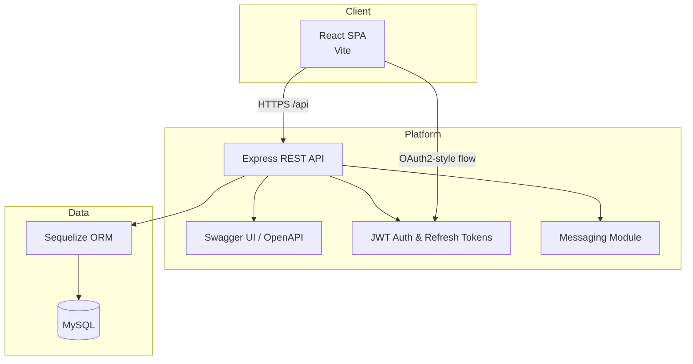

# EnduranceHub Architecture

## Overview

The EnduranceHub solution separates the presentation layer (React SPA) from the RESTful service layer (Node.js/Express) and persists business entities in a MySQL database managed through Sequelize ORM. Authentication is handled with short-lived JWT access tokens and refresh tokens that are stored in the database.

## Component Responsibilities

- **React SPA** - client-side GUI for athletes, specialists, and administrators. Communicates with the API through authenticated `fetch` calls.
- **Express REST API** - exposes CRUD endpoints for athletes, training plans, and nutrition plans (15 methods) plus messaging and auth flows.
- **JWT Auth module** - issues access and refresh tokens, enforces role-based permissions, and handles token rotation.
- **Messaging module** - enables secure communication between team members with inbox/outbox capabilities.
- **Sequelize ORM + MySQL** - persists users, athlete profiles, training plans, nutrition plans, messages, and refresh tokens.
- **Swagger UI/OpenAPI** - interactive documentation served from `/api/docs` describing every API method and error response.

## Deployment Considerations

- Frontend can be hosted as a static site (Netlify, Vercel, Render Static Sites). Environment variable `VITE_API_URL` must point to the deployed backend.
- Backend runs as a long-lived Node service. Environment variables configure MySQL host credentials and JWT secrets. Works on Render, Railway, Fly.io, or any Node-capable platform.
- Managed MySQL (PlanetScale, Railway, Aiven, AWS RDS, etc.) is recommended for production deployments.
